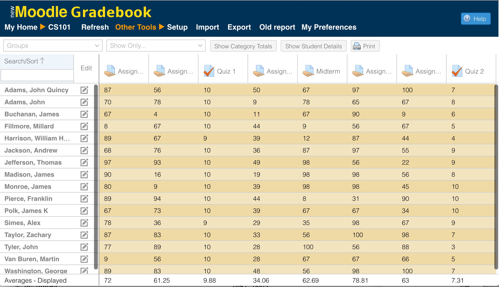

# Easyview grade report Plug-in

Easyview is an excel type read only grader report
which uses the Sencha EXT JS 5.0 framework. 

## Download

## Installation

To configure the easyview grader report with your own Moodle 2.5 instance, simply

1.  Place the plug-in files into your Moodle instance's "grade/report"
    directory.
2.  Log in to your Moodle site. Make sure you have administrative privileges.
3.  In the "Administration" block, follow "Site Administration" > "Notifications".
4.  You should now have your own working version of the Easyview grader report.

## Configuration - required  (most of this we need to fix, but for now you have to do this).

1. After installing the report,  you'll need to follow
the installation instructions in two directories: 
easyview/easyview/README.md and easyview/histogram/README.md.
2. In the get_students() function in [easyview/functions.php](easyview/functions.php), on [line 146](easyview/functions.php#L146), the
roleid might be different for your system. It is meant to limit the search to
only students.
3. The moodle DB prefixes in functions.php and other json.php files may be different for your moodle system 
4. In the index.php file, there are javascript variables where you can
set the "back" and "help" link of the application. You may want ot set these
to suit your needs.

## Features

### View Grades

Teachers with access to a course, will see a new report in the view part of the gradebook.
This will show the teach an excel grid of the grades.  There are a few mechanisms to filter -

1. filter by group (minimize # of students in view)
2. view only grade items in a specific category
3. filter by student name search
4. show/hide category totals/course totals
5. show/hide student info
6. you can sort by any field
7. you can drag and drop columns in the sheet to the left or right
8. There are actions for each grade item, some to edit via quickedit, view histogram and can be extended to other actions.

### View Histogram

This is an optional component, In order to use, you have to install some stored procedures
in your database  (which requires admin access on your database server).   This component
can be enabled or disabled in the config_path.php file.   
We provide an integrated graphing tool which will show a histogram on grade scores, along with
some statistical information.  It is possible to use just the histogram component, linking its
access to other areas such as categories and items.

## License

The easyview grader report has a GNU General Public License v2.
See the "LICENSE" file for details.

## Sencha EXT JS License info
As this code uses the Sencha EXTJS
5.0 code, if you develop using this code, you will require a Sencha EXTJS
5.0 developer license.  If you are using the application as is, you aren't
required a developer license.

## Known Issues

This is considered to be an example/working prototype for the future of a gradebook report, it works,
but there might be issues on edge cases of a gradebook. 

There are hard coded links for the histogram and quickedit, which you may not 
want to offer your teachers.   These can be enabled in the config_path.php file.

If you use the histogram capability, you will have to install two stored procedures
to gather the data for the histogram.  Its possible this could have been done
with a single query, or a series, but we found the stored procedure to work well for us.

For both easyview and histogram, there are some installation steps for each module in 
easyview/easyview/README.md and easyview/histogram/README.md

## Credits

The easyview grader report was coded by Alex Simes and designed by Steve Miley and Alex Simes,
created for use by [GauchoSpace](https://gauchospace.ucsb.edu/), UCSB's primary online learning environment.

Copyright 2014 UC Regents.

## Change Log

Initial Release.
